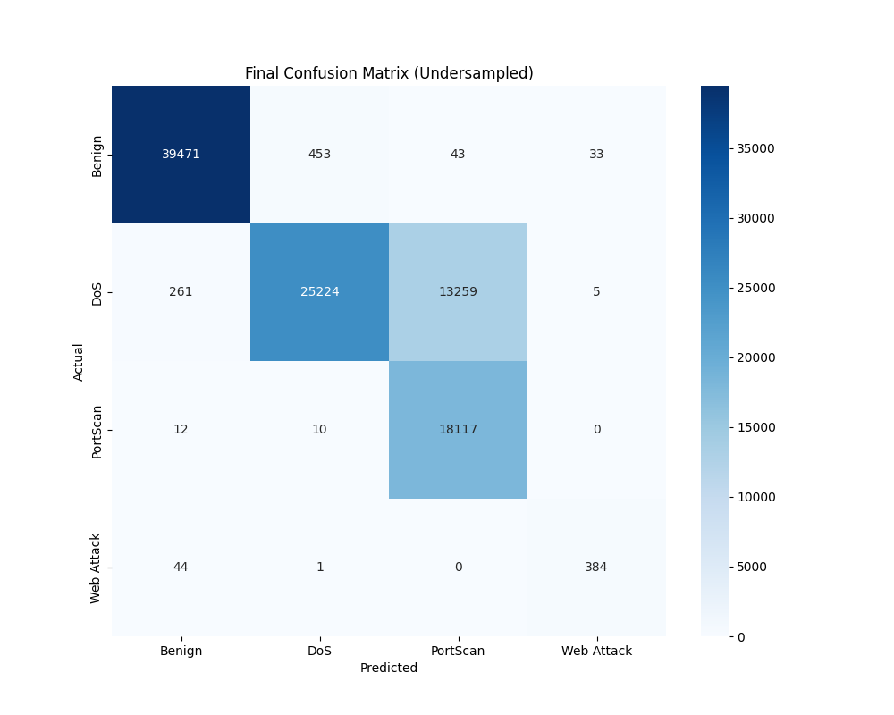

# 🚀 End-to-End ML Intrusion Detection System (IDS)


---

### 📌 Overview

This project is a **production-ready ML Intrusion Detection System (IDS)** that detects and classifies malicious network activity.  
It implements the **full MLOps lifecycle** — from raw data ingestion to deployment as a containerized API.

- **Dataset**: [CIC-IDS2017](https://www.unb.ca/cic/datasets/ids-2017.html)  
- **Threats Detected**: `Benign`, `DoS`, `PortScan`, `Web Attack`  
- **Serving**: FastAPI + Dockerized microservice  

---

### ⚡ Tackling the Challenge: Class Imbalance

The **CIC-IDS2017 dataset** suffers from severe **class imbalance**:  
- Common threats (e.g., `DoS`) dominate the dataset.  
- Rare threats (e.g., `Web Attack`) often get ignored by naive models.  

👉 Initial models achieved high accuracy but **failed on rare attacks** (`Web Attack` precision = 6%).  

✅ This project applies **balancing techniques** (strategic undersampling, resampling, and advanced evaluation), boosting `Web Attack` precision to **91%** while maintaining strong performance across all classes.  

---

### 📊 Final Model Performance

| Class         | Precision | Recall | F1-Score |
| :------------ | :-------- | :----- | :------- |
| **Benign**    | 0.99      | 0.99   | 0.99     |
| **DoS**       | 0.98      | 0.65   | 0.78     |
| **PortScan**  | 0.58      | 1.00   | 0.73     |
| **Web Attack**| 0.91      | 0.90   | 0.90     |

📌 Balanced performance → Robust IDS for real-world deployment.  



---

### 🛠️ Running the Project

This project is **fully containerized** → simple setup, no dependency conflicts.

#### ✅ Prerequisites
- [Docker Desktop](https://www.docker.com/products/docker-desktop) installed & running

---

#### 1️⃣ Build & Run the Container

```bash
docker-compose up --build -d
```

➡ FastAPI server will start at: **http://127.0.0.1:8000**

---

#### 2️⃣ Test the API

**Example: Benign Sample**

```bash
curl -X POST "http://127.0.0.1:8000/predict" -H "Content-Type: application/json" -d '{"Flow Duration": 3, "Total Fwd Packets": 2, "Total Backward Packets": 0, "Total Length of Fwd Packets": 12, "Total Length of Bwd Packets": 0, "Fwd Packet Length Mean": 6, "Bwd Packet Length Mean": 0, "Flow Bytes/s": 4000000, "Flow IAT Mean": 3, "Flow IAT Std": 0, "Flow IAT Max": 3, "Flow IAT Min": 3, "Fwd IAT Mean": 3, "Fwd IAT Std": 0, "Fwd IAT Max": 3, "Fwd IAT Min": 3, "Bwd IAT Mean": 0, "Bwd IAT Std": 0, "Bwd IAT Max": 0, "Bwd IAT Min": 0, "Min Packet Length": 6, "Max Packet Length": 6, "Packet Length Mean": 6, "Packet Length Std": 0, "Packet Length Variance": 0, "Average Packet Size": 9, "Avg Fwd Segment Size": 6, "Avg Bwd Segment Size": 0}'
```

**Expected Response**
```json
{"prediction": "Benign"}
```

---

**Example: PortScan Attack**

```bash
curl -X POST "http://127.0.0.1:8000/predict" -H "Content-Type: application/json" -d '{"Flow Duration": 27, "Total Fwd Packets": 1, "Total Backward Packets": 1, "Total Length of Fwd Packets": 0, "Total Length of Bwd Packets": 6, "Fwd Packet Length Mean": 0.0, "Bwd Packet Length Mean": 6.0, "Flow Bytes/s": 222222.2222, "Flow IAT Mean": 27.0, "Flow IAT Std": 0.0, "Flow IAT Max": 27, "Flow IAT Min": 27, "Fwd IAT Mean": 0.0, "Fwd IAT Std": 0.0, "Fwd IAT Max": 0, "Fwd IAT Min": 0, "Bwd IAT Mean": 0.0, "Bwd IAT Std": 0.0, "Bwd IAT Max": 0, "Bwd IAT Min": 0, "Min Packet Length": 0, "Max Packet Length": 6, "Packet Length Mean": 2.0, "Packet Length Std": 3.464101615, "Packet Length Variance": 12.0, "Average Packet Size": 3.0, "Avg Fwd Segment Size": 0.0, "Avg Bwd Segment Size": 6.0}'
```

**Expected Response**
```json
{"prediction": "PortScan"}
```

---

#### 3️⃣ Stop the Container
```bash
docker-compose down
```

---

### 📂 Project Structure

```
.
├── data/                 # Raw & processed datasets
├── models/               # Final trained model artifacts
├── reports/              # Evaluation reports & figures
├── src/                  # Core source code
│   ├── eda.py            # Data cleaning & preprocessing
│   ├── train_advanced.py # Final model training pipeline
│   └── server.py         # FastAPI application
├── .dockerignore
├── .gitignore
├── docker-compose.yml
├── Dockerfile
└── requirements.txt
```

---

### 🌟 Key Highlights
- ✅ **End-to-End MLOps** → Data → Training → Deployment  
- ✅ **FastAPI** for scalable, production-ready serving  
- ✅ **Dockerized** → portable & reproducible  
- ✅ **Class imbalance solved** → rare threats detected reliably  

---

📢 Contributions, suggestions, and improvements are welcome! 🚀
